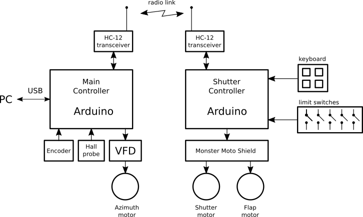
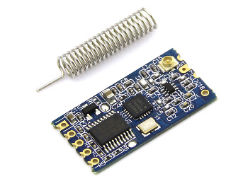
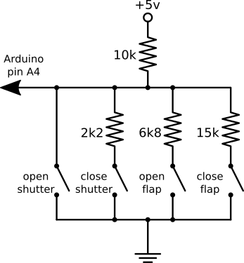

ArduinoDomeController
=====================

An astronomical observatory dome controller based on two Arduino boards.

 * The main controller (DomeController)
 * The shutter controller (DomeShutter)

 

Main controller
---------------

The main controller is connected to a PC by a USB cable. It uses the MaxDome II serial
protocol for compatibility with existing software.

Azimuth angle is read by an optical encoder connected to a rubber wheel that
rotates with the dome. A hall probe is used to detect the "home" mark, wich
serves as an absolute reference for azimuth angle.

The EDII dome is driven by two 12V DC motors with a maximum current of 4A each.
 
For more details, read the definitions in [DomeController.ino](DomeController/DomeController.ino).

Shutter controller
------------------

The shutter controller is mounted in the rotating dome and it is powered by
a 12v lead-acid battery. The battery can be charged with

 * a solar panel
 * a trickle charger wich is connected to the battery when the dome is
   in the home position using two brushes. This is the default solution from ExploraDome

The shutter controller communicates with the main board by means of a serial
radio link created with HC-12 modules.

 

The shutter is controlled by a [Monster Moto Shield](https://www.sparkfun.com/products/10182).

Five limit switches are used. Pin numbers are defined in [DomeShutter.ino](DomeShutter/DomeShutter.ino).

 * Shutter closed
 * Shutter fully open

The 4-button keyboard in the shutter controller is read using only one analog pin.

 

For more details, read the definitions in [DomeShutter.ino](DomeShutter/DomeShutter.ino).
